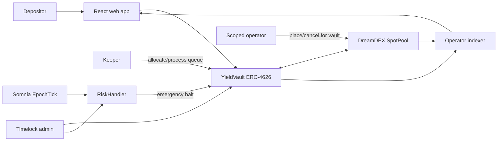
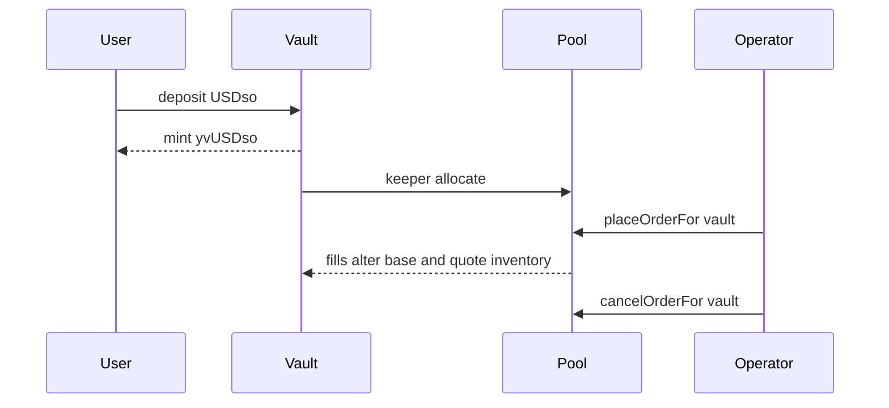
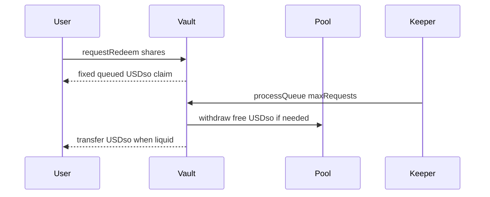

# Architecture

This repository is a non-upgradeable ERC-4626 reference implementation for
deploying pooled USDso into DreamDEX manual-vault balances while keeping the
market-making key unable to withdraw depositor assets.

## Components

`YieldVault` owns all capital and DreamDEX balances. Depositors receive yvUSDso
shares. The off-chain operator is authorized only through DreamDEX's per-pool
registry for `placeOrderFor` and `cancelOrderFor`; it has no vault role, token
allowance, or withdrawal path.

## Role and trust boundaries

| Actor | Authority | Explicitly cannot |
|---|---|---|
| Depositor | Deposit, mint, redeem, request queued withdrawal | Move another owner's shares |
| Operator hot key | Place and cancel orders for the vault | Withdraw pool balances or call keeper/admin methods |
| Keeper key | Allocate idle quote and process FIFO claims | Change configuration or receive user funds |
| Guardian | Emergency halt and cancel orders | Unpause or transfer vault assets |
| RiskHandler | Emergency halt after an unsafe EpochTick | Unpause or change its own thresholds |
| Timelock admin | Configuration, roles, operator approval, unpause | Bypass the configured delay |

Use a separate `KEEPER_PRIVATE_KEY`; never grant `KEEPER_ROLE` to the quoting
hot key.

## NAV accounting

Gross managed assets are:

1. USDso held by the vault.
2. Withdrawable USDso in the DreamDEX manual vault.
3. Withdrawable base inventory marked at top-of-book midpoint after
   `baseHaircutBps`.
4. Remaining bid principal and marked remaining ask inventory in open orders.

If either book side is empty, base inventory is marked to zero. Net ERC-4626
`totalAssets` subtracts fixed queued liabilities. Therefore locking principal
in a resting order does not change NAV, while adverse inventory marks and fees
can reduce share price.

## Deposit and market-making flow

`minIdleBps` constrains keeper allocation so a configured fraction stays in the
vault for instant redemptions.

## Withdrawal semantics

Instant ERC-4626 redemption is allowed only when no queued liability exists and
vault-held idle USDso covers the request. Pool balances and resting orders are
part of NAV but are not instant-redemption liquidity.

`requestRedeem` burns shares immediately at current NAV and records a fixed
USDso claim. Claims are processed FIFO:

Queued claims have priority over all later instant exits. Locked orders must
fill or be cancelled before that liquidity becomes withdrawable.

## Risk and liveness

`RiskHandler` subscribes only to Somnia `EpochTick`, avoiding per-fill callback
costs. A crossed book, excessive spread, or excessive midpoint movement calls
`emergencyHalt`, which pauses the vault, revokes operator approval, and attempts
to cancel all orders.

The operator exposes `/health`, `/metrics`, and `/analytics`. Its watchdog
checks quoting against live exposure, analytics freshness, withdrawal queue
age, vault pause state, optional keeper configuration, and RiskHandler
subscription status. An unhealthy response uses HTTP 503 for Railway restart
policy; warnings such as an unsubscribed RiskHandler are `degraded`.

RiskHandler is an on-chain fallback, not a replacement for the operator or
keeper. See [operator-runbook.md](operator-runbook.md) for incident actions and
[building-a-dreamdex-vault.md](building-a-dreamdex-vault.md) for an integration
walkthrough.
